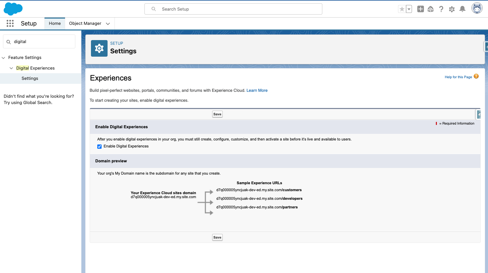
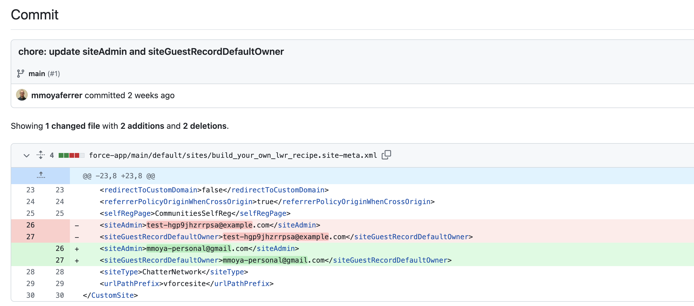

# Recipe for Experience Cloud (Aura) CICD with Hutte

## Introduction

Creating an Experience Cloud site in Salesforce generates a significant amount of metadata, which can be confusing when deploying the site to a higher environment. This raises the question: "What do we need to deploy and how do we deploy it?"

The answer is simple! As with any other metadata, it's recommended to use a Git-based strategy with the Metadata API for deployment. To make this process easier, Hutte provides an excellent UI & UX. To understand what needs to be deployed, Salesforce offers great [documentation](https://help.salesforce.com/s/articleView?id=sf.networks_migrating_from_sandbox.htm&type=5), which will be referenced throughout this recipe to explain the steps in detail.

Due to differences in the steps depending on whether your Experience Cloud site is LWR or Aura, we have created two recipes:

- If you are looking for steps for a site using the LWC framework, you are in the correct recipe.
- If you are looking for steps for a site using the Aura framework, navigate to the [cicd-experience-cloud-aura recipe](https://github.com/hutte-recipes/cicd-experience-cloud-aura).

This recipe includes the [cicd-incremental-deployment](https://github.com/hutte-recipes/cicd-incremental-deployment) recipe to validate (in a pull request) and deploy the Experience Cloud sites. See more about this recipe in the linked repository.

## Prerequisites

### Experience Cloud Site Creation

1. In your Hutte project, create a new Hutte feature, assigning the Org where you will create the Experience Cloud Site. It's important to create the Hutte Feature before making changes so that Hutte can track the new changes, making the commit experience simpler and quicker.
2. Create a Help Center Site in your development Org (Digital Experiences) - See [Salesforce docs](https://help.salesforce.com/s/articleView?id=sf.networks_help_center_create.htm&type=5).

   

3. Add the [Sample](./docs/images/sample.jpeg) image as a background to the Hero component (see below screenshot).

   

4. Save the changes.

   

### GitHub Setup

- Follow the steps specified in the [README.md](https://github.com/hutte-recipes/cicd-incremental-deployment) file of the `cicd-incremental-deployment` recipe to configure the GitHub Actions that will validate and deploy the delta changes of the Experience Cloud site to the destination org.

### Enable Digital Experiences in the Destination Org

- Ensure "Digital Experiences" is enabled in "Setup" -> "Feature Settings" -> "Digital Experiences" -> "Settings".

   

## Steps

Once we have completed the prerequisites, created the site, configured GitHub, and enabled Digital Experiences in the destination org, we can proceed with tracking the site changes in Git and deploying them. Here are the steps:

_Note: Steps 1, 2, and 3 can be combined into a single commit. For clarity and separation of concerns, these instructions are split into three different commits._

1. **Commit the baseline metadata:** Navigate to the previously created Hutte feature, click `Pull Changes`. A long list of changes will display, which is expected since Salesforce does a lot behind the scenes when creating a site. Only select some of these changes (as specified in the [Salesforce docs](https://help.salesforce.com/s/articleView?id=sf.networks_migrating_from_sandbox.htm&type=5)).

   

   Note: All other metadata will be automatically generated in the destination org upon deployment; we won't need to deploy them.

2. **Commit some extra metadata to avoid deployment issues:** For Aura Communities, including the Help Center community, commit the `SiteDotCom` instead of `ExperienceBundle` (see [Tips and Considerations](https://help.salesforce.com/s/articleView?id=sf.networks_migrating_from_sandbox.htm&type=5)). Commit the `CommunitiesLanding` ApexPage, its Apex Controller, and the respective Apex test class to avoid deployment issues.

   

3. **Commit the customizations:** Apart from the baseline site, we also added a `Sample` image as a background to the `Hero` component. Add the `ContentAsset` that includes this change.

   

4. **Replacement of `siteAdmin` and `siteGuestRecordDefaultOwner`:** Due to an internal limitation of the Experience Cloud committed metadata, the `.site` metadata is committed with the `siteAdmin` and `siteGuestRecordDefaultOwner` of the Salesforce user in the developer org. Change these fields in GitHub to use the username of the site admin in the destination environment (ensure this Salesforce user exists in the destination org). This task requires some Git skills, so reach out to a person with Git knowledge if needed.

   

5. **Create a Pull Request through Hutte:** Creating a GitHub Pull Request (which we can do from the Hutte UI) allows another person to review the changes. A deployment validation will automatically run as part of the GitHub action from the [cicd-incremental-deployment recipe](https://github.com/hutte-recipes/cicd-incremental-deployment). This action validates that the changes included in the Pull Request can be deployed to the destination org without issues, without actually deploying any changes.

   

   

   By checking the details of the GitHub action run, you can see the logs of the metadata changes being validated.

   

6. **Merge the Pull Request & automated deployment to the destination org:** Upon successful validation and code review, merge the Pull Request. An automated GitHub Action (from the [cicd-incremental-deployment recipe](https://github.com/hutte-recipes/cicd-incremental-deployment)) will deploy the changes to the destination org.

   

After the GitHub action is successful, verify the changes in the destination org.
